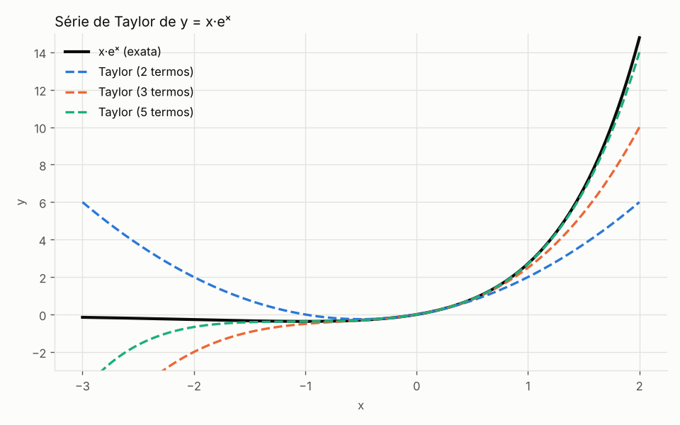
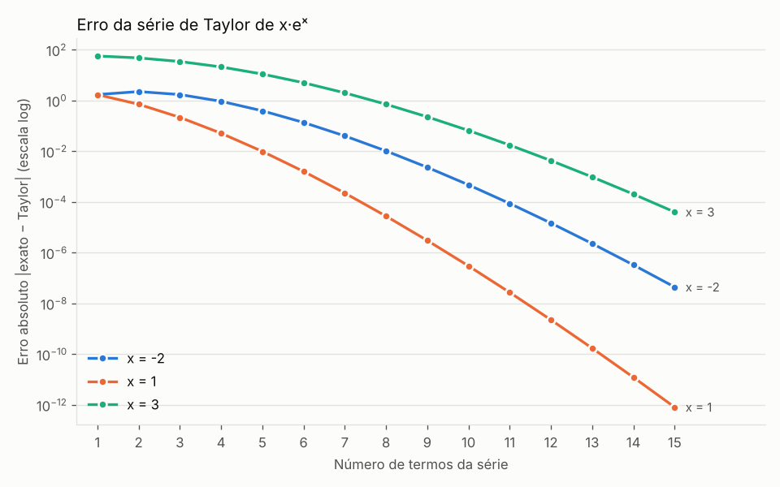
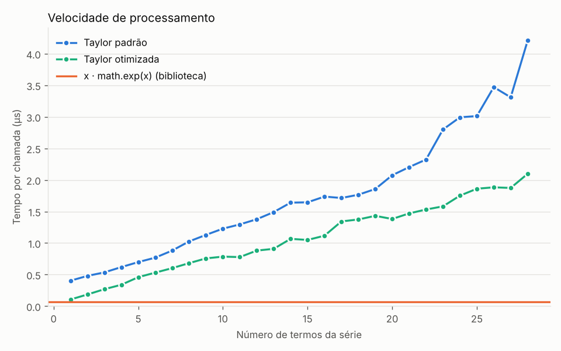
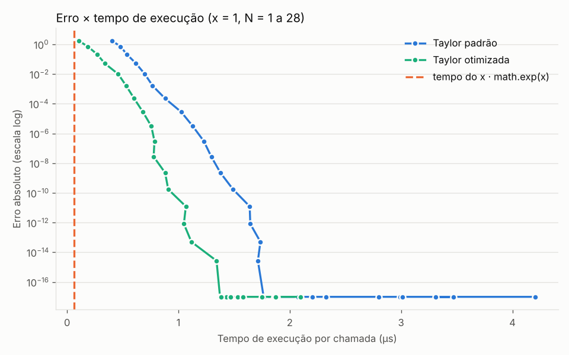

# EP 1 – Cálculos Complexos com Séries de Taylor

**Tema:** Cálculos Complexos com Séries de Taylor – função `y = x · eˣ` (exponencial × x)

**Integrantes do grupo:**

- Bernardo Pereira Kubo

Todo o código está em um único arquivo, [`serie_taylor.py`](serie_taylor.py), em Python (biblioteca padrão para os cálculos e `matplotlib`/`numpy` apenas para os gráficos). **Nenhuma biblioteca simbólica (Sympy) foi usada**: as derivadas foram deduzidas à mão.

---

## 1. Cálculo de Taylor

### 1.1 Derivadas (feitas à mão)

Pela regra do produto, com `f(x) = x · eˣ`:

```
f(x)    = x·eˣ
f'(x)   = eˣ + x·eˣ        = (x + 1)·eˣ
f''(x)  = eˣ + (x+1)·eˣ    = (x + 2)·eˣ
f'''(x) = eˣ + (x+2)·eˣ    = (x + 3)·eˣ
```

A cada derivada, o número somado a `x` aumenta em 1, então o padrão geral é:

```
f⁽ⁿ⁾(x) = (x + n)·eˣ
```

Avaliando em `x = 0` (série de Maclaurin), como `e⁰ = 1`:

```
f⁽ⁿ⁾(0) = n        coeficiente = f⁽ⁿ⁾(0) / n! = n / n! = 1 / (n−1)!
```

| n | f⁽ⁿ⁾(0) | f⁽ⁿ⁾(0)/n! |
|---|---|---|
| 0 | 0 | 0 |
| 1 | 1 | 1 |
| 2 | 2 | 1 |
| 3 | 3 | 1/2 |
| 4 | 4 | 1/6 |
| 5 | 5 | 1/24 |

Logo:

```
x·eˣ = x + x² + x³/2! + x⁴/3! + x⁵/4! + ...  =  Σ (k ≥ 1)  xᵏ / (k−1)!
```

Essa série é a mesma que se obtém multiplicando por `x` a série de `eˣ` (`Σ xⁿ/n!`). O código confere os dois caminhos (`taylor_por_derivadas` e `taylor`) e eles dão o mesmo resultado.

### 1.2 Qual é o limite N? Por quê?

O primeiro termo descartado depois de `N` termos é `x^(N+1) / N!`.
Para `|x| ≤ 3` e tolerância de `10⁻¹⁵`, o menor `N` que faz esse termo ficar abaixo da tolerância é:

> **N = 28**

Por que esse valor:

- O `float` (double) guarda cerca de 15 a 16 dígitos. Termos menores que `10⁻¹⁵` já não mudam o resultado.
- Depois desse N, cada termo extra só aumenta o tempo de execução, sem ganho de precisão.
- Quanto maior `|x|`, mais termos são necessários. Menor N para erro absoluto < `10⁻¹²`:

| x | -3 | -2 | -1 | -0,5 | 0 | 0,5 | 1 | 2 | 3 |
|---|---|---|---|---|---|---|---|---|---|
| menor N | 25 | 20 | 15 | 12 | 1 | 12 | 15 | 20 | 25 |

Os valores de `X_MAX` (3) e `TOLERANCIA` (`1e-15`) ficam no começo do código e o `N` é recalculado automaticamente se forem alterados. Para valores de |x| muito maiores, o limite deve ser reavaliado (e, para x negativo grande, a série alterna sinais e tende a perder precisão).

### 1.3 Função otimizada

A versão simples (`taylor`) recalcula `x**k` e `factorial(k-1)` em cada termo. A versão otimizada (`taylor_otimizada`) calcula cada termo a partir do anterior:

```
t1 = x
tk = t(k−1) · x / (k−1)
```

```python
def taylor_otimizada(x, n_max=N_LIMITE, tol=TOLERANCIA):
    termo = x
    soma = x
    for k in range(2, n_max + 1):
        termo = termo * x / (k - 1)
        soma += termo
        if abs(termo) < tol:
            break
    return soma
```

Vantagens: sem fatorial, sem potência e com parada antecipada quando o termo fica menor que a tolerância. O resultado é o mesmo da versão simples, a menos de diferenças de arredondamento da ordem de `10⁻¹⁶` em termos relativos.

---

## 2. Aproximações e propriedades

**Polinômios de Taylor (em torno de 0):**

```
P1(x) = x
P2(x) = x + x²
P3(x) = x + x² + x³/2
P4(x) = x + x² + x³/2 + x⁴/6
P5(x) = x + x² + x³/2 + x⁴/6 + x⁵/24
```

**Propriedades:**

- Raio de convergência infinito: a série converge para todo `x` real.
- `f(0) = 0` e `f'(x) = (1 + x)·eˣ`, então o único ponto crítico é `x = −1`, que é um mínimo global: `f(−1) = −1/e ≈ −0,367879`.
- `f(x) → 0` quando `x → −∞` e `f(x) → +∞` quando `x → +∞`.
- Primitiva: `∫ x·eˣ dx = (x − 1)·eˣ + C`.
- Resto de Lagrange: `R_N(x) = f⁽ᴺ⁺¹⁾(c)·x^(N+1) / (N+1)!`, com `c` entre 0 e `x`. Para `x > 0`, vale `|R_N(x)| ≤ (x + N + 1)·eˣ·x^(N+1) / (N+1)!`.
- Perto de 0, o erro é aproximadamente o primeiro termo descartado, `x^(N+1) / N!`.

Erro real × limite de Lagrange em `x = 1`:

| termos | erro real | limite de Lagrange | 1º termo descartado |
|---|---|---|---|
| 2 | 7,18e-01 | 1,81e+00 | 5,00e-01 |
| 4 | 5,16e-02 | 1,36e-01 | 4,17e-02 |
| 6 | 1,62e-03 | 4,31e-03 | 1,39e-03 |
| 8 | 2,79e-05 | 7,49e-05 | 2,48e-05 |
| 10 | 3,03e-07 | 8,17e-07 | 2,76e-07 |

O erro real fica sempre abaixo do limite teórico, como esperado.



---

## 3. Tabela de valores fixos

Valores exatos (`x·eˣ` com `math.exp`) e aproximações de Taylor com 3, 5 e 10 termos. O arquivo completo está em [`resultados/tabela_valores.csv`](resultados/tabela_valores.csv).

| x | exato x·eˣ | Taylor 3 | erro 3 | Taylor 5 | erro 5 | Taylor 10 | erro 10 |
|---|---|---|---|---|---|---|---|
| -3 | -0.14936121 | -7.50000000 | 7.35e+00 | -4.12500000 | 3.98e+00 | -0.11116071 | 3.82e-02 |
| -2 | -0.27067057 | -2.00000000 | 1.73e+00 | -0.66666667 | 3.96e-01 | -0.27019400 | 4.77e-04 |
| -1 | -0.36787944 | -0.50000000 | 1.32e-01 | -0.37500000 | 7.12e-03 | -0.36787919 | 2.52e-07 |
| -0.5 | -0.30326533 | -0.31250000 | 9.23e-03 | -0.30338542 | 1.20e-04 | -0.30326533 | 1.29e-10 |
| 0 | 0.00000000 | 0.00000000 | 0.00e+00 | 0.00000000 | 0.00e+00 | 0.00000000 | 0.00e+00 |
| 0.5 | 0.82436064 | 0.81250000 | 1.19e-02 | 0.82421875 | 1.42e-04 | 0.82436064 | 1.41e-10 |
| 1 | 2.71828183 | 2.50000000 | 2.18e-01 | 2.70833333 | 9.95e-03 | 2.71828153 | 3.03e-07 |
| 2 | 14.77811220 | 10.00000000 | 4.78e+00 | 14.00000000 | 7.78e-01 | 14.77742504 | 6.87e-04 |
| 3 | 60.25661077 | 25.50000000 | 3.48e+01 | 49.12500000 | 1.11e+01 | 60.19017857 | 6.64e-02 |

A série é muito precisa perto de 0 e perde precisão conforme `|x|` cresce: com 10 termos, o erro em `x = 3` ainda é de cerca de `0,066`.

---

## 4. Erros da função × tempo de execução

### Erro em função do número de termos



O erro cai de forma exponencial, porque o fatorial no denominador cresce mais rápido que a potência no numerador. Quanto maior `|x|`, mais termos são necessários para o mesmo erro (com 15 termos, o erro em `x = 3` ainda é de cerca de `4·10⁻⁵`, enquanto em `x = 1` já é de cerca de `8·10⁻¹³`).

### Tempo de execução



O tempo cresce de forma aproximadamente linear com o número de termos. A versão otimizada é, em geral, mais rápida que a versão simples. Já o `math.exp` da biblioteca é muito mais rápido que qualquer uma das duas séries. Os tempos exatos dependem do computador e variam um pouco entre execuções; para ver os valores da sua máquina, rode o script (o resumo aparece no terminal).

### Erro × tempo



Cada ponto corresponde a um valor de `N` (de 1 a 28), com `x = 1`. Para atingir o mesmo erro, a versão otimizada gasta menos tempo. Para `x = 1`, com cerca de 18 termos o erro chega a zero (a série já coincide com o valor exato dentro da precisão do double; na escala logarítmica o zero aparece como `1e-17`). Os termos seguintes só aumentam o tempo, e é isso que justifica escolher um N limite em vez de somar termos indefinidamente.

---

## 5. Instalação, execução e exemplos

### 5.1 Instalação das bibliotecas

Requisito: Python 3.8 ou superior (testado com Python 3.13). Depois de baixar ou clonar o repositório, dentro da pasta do projeto:

```bash
pip install -r requirements.txt
```

No Windows, se o comando `pip` não for reconhecido: `py -m pip install -r requirements.txt`.

### 5.2 Como rodar

```bash
python serie_taylor.py
```

No Windows, se `python` não for reconhecido: `py serie_taylor.py`.

O programa **não pede nenhum dado de entrada**. Ele imprime no terminal as derivadas, o limite N, as propriedades, a tabela e os tempos, e salva os gráficos e o CSV na pasta `resultados/`.
### 5.3 Exemplos de entrada e saída

**a) Usando as funções diretamente no Python**

Entrada:

```python
from serie_taylor import f, taylor, taylor_otimizada, derivada, N_LIMITE

print(f(1.0))                # valor exato de x·eˣ em x = 1
print(taylor(1.0, 10))       # Taylor com 10 termos em x = 1
print(taylor_otimizada(1.0)) # versão otimizada em x = 1
print(taylor(2.0, 5))        # Taylor com 5 termos em x = 2
print(derivada(3, 0))        # 3ª derivada em x = 0
print(N_LIMITE)              # limite N da série
```

Saída:

```
2.718281828459045
2.7182815255731922
2.7182818284590455
14.0
3.0
28
```

**b) Rodando o programa completo**

Entrada: nenhuma. Trecho da saída:

```
================================================================
DERIVADAS (feitas à mão, sem Sympy)
================================================================
f(x)    = x * e^x
f'(x)   = e^x + x*e^x       = (x + 1) e^x   (regra do produto)
...
Conferência em x = 1 com 10 termos:
  pela definição (derivadas) : 2.7182815256
  pela série (exp * x)       : 2.7182815256

================================================================
LIMITE N DA SÉRIE (e por quê)
================================================================
N_LIMITE = 28  (vale para |x| <= 3)
...
```

A saída completa de uma execução está em [`resultados/saida.txt`](resultados/saida.txt).

## 6. Estrutura do repositório

```
.
├── README.md                  este relatório
├── serie_taylor.py            código fonte (derivadas, N limite, otimizada, tabela, gráficos)
├── requirements.txt           dependências (matplotlib, numpy)
└── resultados/
    ├── saida.txt              saída do terminal
    ├── tabela_valores.csv     tabela de valores fixos
    ├── serie_taylor.png       função exata × aproximações
    ├── grafico_erros.png      erro × número de termos
    ├── grafico_tempo.png      tempo × número de termos
    └── grafico_erro_vs_tempo.png   erro × tempo de execução
```

## 7. Conclusão

A série de Taylor de `x·eˣ` é simples de obter à mão (`f⁽ⁿ⁾(x) = (x+n)·eˣ`, coeficientes `1/(n−1)!`) e converge para qualquer `x`. Na prática, o número de termos necessário cresce com `|x|` e, a partir de `N = 28` (para `|x| ≤ 3`), não há mais ganho de precisão com `float`. Calcular cada termo a partir do anterior reduz o tempo em relação à versão com fatorial e potência, mas a função `exp` da biblioteca continua sendo a melhor opção quando só o valor da função interessa; a série é útil para entender e controlar a aproximação (erro, número de termos, custo).
